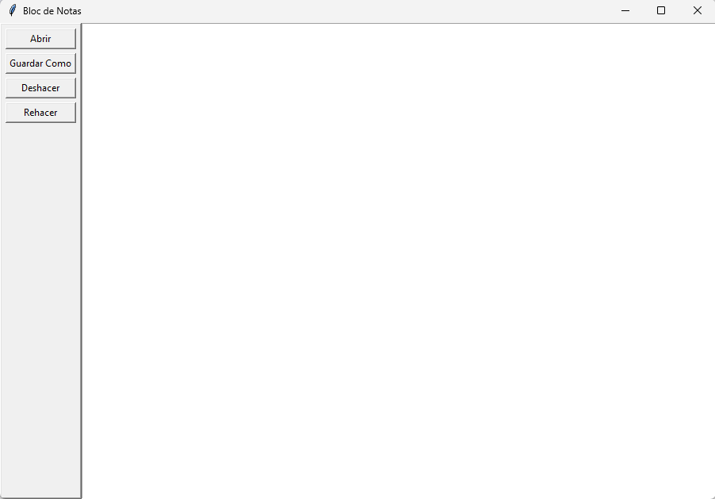

#  B:bookmark_tabs: Bloc de Notas Avanzado :bookmark_tabs:

Bienvenido al Bloc de Notas Avanzado, una aplicación de edición de texto simple, construida con Python y Tkinter, ¡y potenciada por una lista doblemente enlazada para un manejo eficiente del texto!


## :file_folder: Características :file_folder:

- Interfaz gráfica intuitiva
- Funcionalidad de abrir y guardar archivos
- Deshacer y rehacer acciones
- Manejo eficiente del texto con lista doblemente enlazada
- Completamente en español

## :notebook_with_decorative_cover: Cómo empezar :notebook_with_decorative_cover:

1. Clona este repositorio:
    ```bash
    git clone https://github.com/T0NY24/EditorTexto.git
    ```
2. Navega al directorio del proyecto:
    ```bash
    cd EditorTexto
    ```
3. Ejecuta la aplicación:
    ```bash
    python EditorText.py
    ```

## :camera: Capturas de pantalla :camera:




## 🛠️ Tecnologías utilizadas

- Python 3.x
- Tkinter
- Estructura de datos: Lista doblemente enlazada

## :ledger: Contribuir :ledger:

¡Las contribuciones son bienvenidas! :hearts: Si tienes una sugerencia para mejorar esto, por favor bifurca el repositorio. ¡No olvides darle una estrella al proyecto! :trophy: :trophy:

<a href="https://github.com/T0NY24/EditorTexto.git" class="button" style="display: inline-block; padding: 10px 20px; background-color: #3498db; color: white; text-decoration: none; border-radius: 5px; transition: background-color 0.3s;">:octocat: Ver en GitHub :octocat: </a>

## 📄 Documentación 📄

Para obtener información más detallada sobre cómo usar esta aplicación, por favor consulta nuestra guía de usuario completa en PDF:

<a href="img/GPE2.pdf" class="button" style="display: inline-block; padding: 10px 20px; background-color: #3498db; color: white; text-decoration: none; border-radius: 5px; transition: background-color 0.3s;">Descargar Guía de Usuario (PDF)</a>

Link del proyecto: [https://github.com/T0NY24/EditorTexto.git](https://github.com/T0NY24/EditorTexto.git):octocat:
